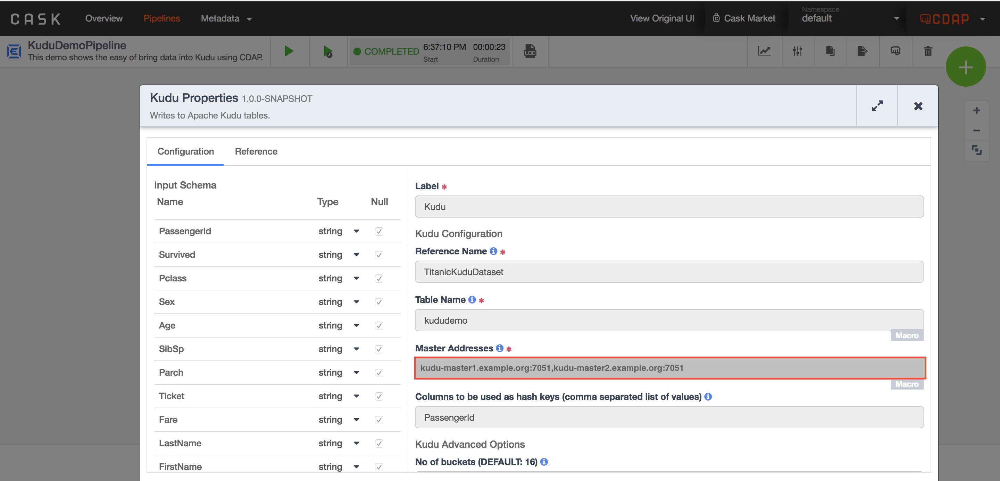
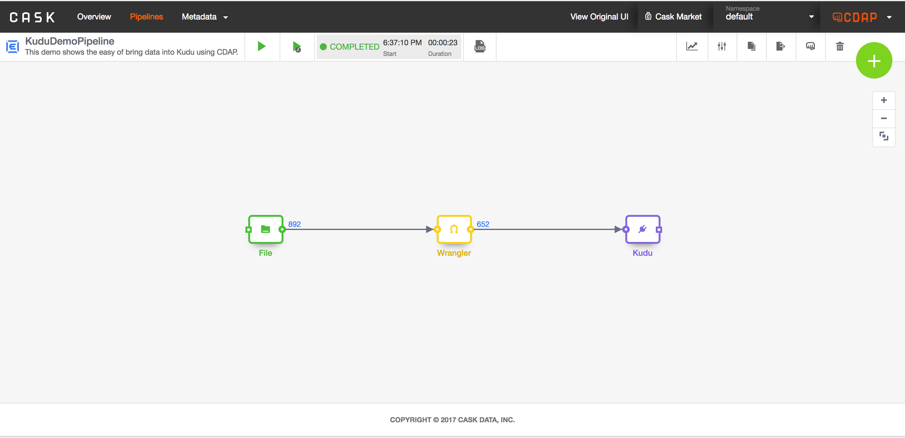

[](https://travis-ci.org/hydrator/kudu-sink) [](https://opensource.org/licenses/Apache-2.0)

Kudu Sink
==========

CDAP Plugin for ingesting data into Apache Kudu. Plugin can be configured for both batch and real-time pipelines.





[Video -- Showing how data can be ingested into Kudu](https://www.youtube.com/watch?v=KBW7a38vlUM)

Usage Notes
-----------
This plugin creates Kudu table on deployment if the table does not exist. When the table already exists in Kudu, the write schema of the plugin is compared with the kudu table schema. If the field name and it's type are not an exact match, the deployment of the pipeline will fail. It will also compare number of fields in write schema are same as fields in Kudu table schema.

Quering from Impala
*******************
In order to query through Impala an external Impala table has to be created as follows : 

```
CREATE EXTERNAL TABLE `<table-name>` STORED AS KUDU
TBLPROPERTIES(
  'kudu.table_name' = '<table-name>',
  'kudu.master_addresses' = '<kudu-master-1>:7051,<kudu-master-2>:7051'
);
```

```kudu.master_addresses``` configuration needs not be specified it impala is started with ```-kudu_impala``` configuration. for more information on how this can be configured check [here](http://kudu.apache.org/docs/kudu_impala_integration.html)

>  Available starting with Impala 2.7.0 that ships with CDH 5.10

Type Conversions
****************

The data types from the CDAP data pipeline are converted to Kudu types. Following is the conversion table. 

| CDAP Schema Type | Kudu Schema Type |
| :--------------: | :--------------: |
| int | int |
| short | short | 
| string | string |
| bytes | binary |
| double | double |
| float | float |
| boolean | bool |
| union | first non-nullable type |

Plugin Configuration
---------------------

| Configuration | Required | Default | Description |
| :------------ | :------: | :----- | :---------- |
| **Table Name** | **Y** | N/A | This configuration specifies the Kudu table name to which the records will be written. This plugin checks if the table already exists. If it exists, it compares the schema of the existing table with the write schema specified for the plugin, If they don't match an error is thrown at configuration time and If the table doesn't exist, the table is created.| 
| **Kudu Master Host** | **Y** | N/A | Specifies the list of Kudu master hosts that this plugin will attempt connect to. It's a comma separated list of &lt;hostname&gt;:&lt;port&gt;. Connection is attempt after the plugin is initialized in the pipeline.  |
| **Fields to Hash** | **Y** | N/A | Specifies the list of fields from the input that should be considered as hashing keys. All the fields should be non-null. Comma separated list of fields to be used as hash keys. |
| **Operation Timeout** | N | 30000ms | This configuration sets the timeout in milliseconds for user operations with Kudu. If you are writing large sized records it's recommended to increase the this time. It's defaulted to 30 seconds. |
| **Admin Timeout** | N | 30000ms | This configuration is used to set timeout in milliseconds for administrative operations like for creating table if table doesn't exist. This time is mainly used during initialize phase of the plugin when the table is created if it doesn't exist. |
| **Hash seed** | N | 1 | The seed value specified is used to randomize mapping of rows to hash buckets. Setting the seed will ensure the hashed columns contain user provided values.| 
| **Number of replicas** | N | 1 | Specifies the number of replicas for the above table. This will specify the number of replicas that each tablet will have. By default it will use the default set on the server side and that is generally 1.| 
| **Compression Algorithm** | N | Snappy | Specifies the compression algorithm to be used for the columns. Following are different options available. |
| **Encoding** | N | Auto Encoding | Specifies the block encoding for the column. Following are different options available.  |
| **Rows to be cached** | N | 1000 | Specifies number of rows to be cached before being flushed |
| **Boss Threads** | N | 1 | Number of boss threads used in the Kudu client to interact with Kudu backend. |
| **No of Buckets** | N | 16 | Number of buckets the keys are split into |

Build
-----
To build this plugin:

```
   mvn clean package -DskipTests
```    

The build will create a .jar and .json file under the ``target`` directory.
These files can be used to deploy your plugins.

Deployment
----------
You can deploy your plugins using the CDAP CLI:

    > load artifact <target/plugin.jar> config-file <target/plugin.json>

For example, if your artifact is named 'kudu-sink-1.0.0':

    > load artifact target/kudu-sink-1.0.0.jar config-file target/kudu-sink-1.0.0.json
    
## Mailing Lists

CDAP User Group and Development Discussions:

* `cdap-user@googlegroups.com <https://groups.google.com/d/forum/cdap-user>`

The *cdap-user* mailing list is primarily for users using the product to develop
applications or building plugins for appplications. You can expect questions from 
users, release announcements, and any other discussions that we think will be helpful 
to the users.

## IRC Channel

CDAP IRC Channel: #cdap on irc.freenode.net


## License and Trademarks

Copyright © 2016-2017 Cask Data, Inc.

Licensed under the Apache License, Version 2.0 (the "License"); you may not use this file except
in compliance with the License. You may obtain a copy of the License at

http://www.apache.org/licenses/LICENSE-2.0

Unless required by applicable law or agreed to in writing, software distributed under the 
License is distributed on an "AS IS" BASIS, WITHOUT WARRANTIES OR CONDITIONS OF ANY KIND, 
either express or implied. See the License for the specific language governing permissions 
and limitations under the License.

Cask is a trademark of Cask Data, Inc. All rights reserved.

Apache, Apache HBase, and HBase are trademarks of The Apache Software Foundation. Used with
permission. No endorsement by The Apache Software Foundation is implied by the use of these marks.    
