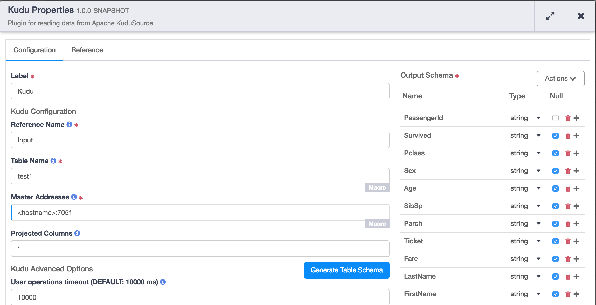

[](https://travis-ci.org/hydrator/kudu-source) [](https://opensource.org/licenses/Apache-2.0)

Kudu Source
==========

CDAP Plugin for reading data from Apache Kudu table. 




Usage Notes
-----------

This plugin is configured to pull rows from a Kudu table using the Kudu native client. When configuring this plugin in a pipeline one can use the **"Generate Table Schema"** to automatically create the CDAP schema from the Kudu table. In order to generate the schema, you would have to first specify the ```Table name``` and the ```Master address```. 

In case, one of the configuration (either Table name or Master address) is a macro the **"Generate Table Schema"** will not work. The best way is to provide a non-macros configuration to generate the schema first and then change it the configuration use macro.

The plugin also supports projecting columns efficiently when it's specified. If '\*' is specified then all the columns in the table are projected else only the fields specified will be projected. Please make sure the columns to be projected are specified before schema is generated. 

Plugin Configuration
---------------------

| Configuration | Required | Default | Description |
| :------------ | :------: | :----- | :---------- |
| **Table Name** | **Y** | N/A | This configuration specifies the Kudu table name to which the records will be written. This plugin checks if the table already exists. If it exists, it compares the schema of the existing table with the write schema specified for the plugin, If they don't match an error is thrown at configuration time and If the table doesn't exist, the table is created.|
| **Kudu Master Host** | **Y** | N/A | Specifies the list of Kudu master hosts that this plugin will attempt connect to. It's a comma separated list of &lt;hostname&gt;:&lt;port&gt;. Connection is attempt after the plugin is initialized in the pipeline.  |
| **Column Projection** | **N** | '*' | Specifies the columns to be projected. By default it's '*' for projecting all columns in the table.
| **Operation Timeout** | N | 30000ms | This configuration sets the timeout in milliseconds for user operations with Kudu. If you are writing large sized records it's recommended to increase the this time. It's defaulted to 30 seconds. |


Build
-----
To build this plugin:

```
   mvn clean package -DskipTests
```    

The build will create a .jar and .json file under the ``target`` directory.
These files can be used to deploy your plugins.

Deployment
----------
You can deploy your plugins using the CDAP CLI:

    > load artifact <target/plugin.jar> config-file <target/plugin.json>

For example, if your artifact is named 'kudu-source-1.0.0':

    > load artifact target/kudu-source-1.0.0.jar config-file target/kudu-source-1.0.0.json
    
## Mailing Lists

CDAP User Group and Development Discussions:

* `cdap-user@googlegroups.com <https://groups.google.com/d/forum/cdap-user>`

The *cdap-user* mailing list is primarily for users using the product to develop
applications or building plugins for appplications. You can expect questions from 
users, release announcements, and any other discussions that we think will be helpful 
to the users.

## IRC Channel

CDAP IRC Channel: #cdap on irc.freenode.net


## License and Trademarks

Copyright © 2016-2017 Cask Data, Inc.

Licensed under the Apache License, Version 2.0 (the "License"); you may not use this file except
in compliance with the License. You may obtain a copy of the License at

http://www.apache.org/licenses/LICENSE-2.0

Unless required by applicable law or agreed to in writing, software distributed under the 
License is distributed on an "AS IS" BASIS, WITHOUT WARRANTIES OR CONDITIONS OF ANY KIND, 
either express or implied. See the License for the specific language governing permissions 
and limitations under the License.

Cask is a trademark of Cask Data, Inc. All rights reserved.

Apache, Apache HBase, and HBase are trademarks of The Apache Software Foundation. Used with
permission. No endorsement by The Apache Software Foundation is implied by the use of these marks.    
